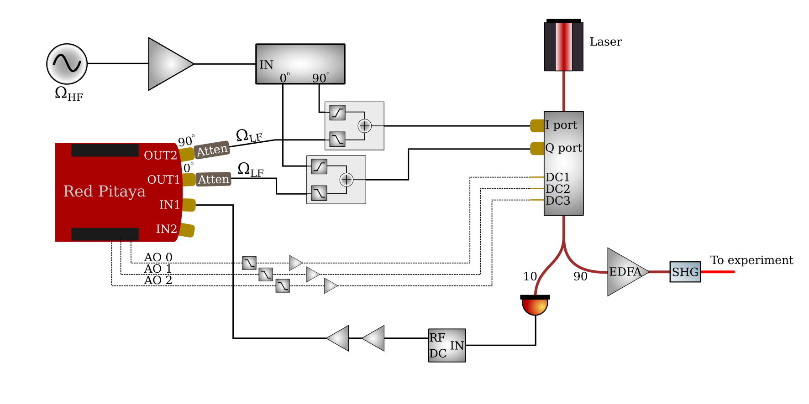
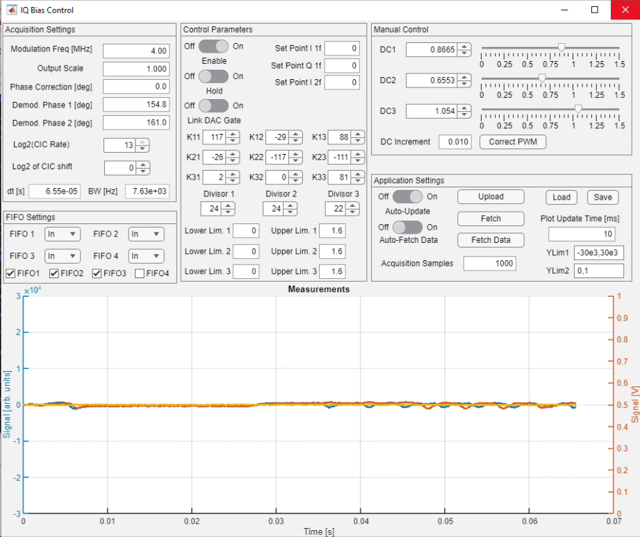

# IQ Modulator Bias Control

This project implements a digital bias controller for an IQ modulator running in carrier-suppressed single-sideband (CS-SSB) mode.  It is based on [this paper](http://opg.optica.org/ao/abstract.cfm?uri=ao-62-1-1) which detailed an analog stabilisation scheme using the same technique.  The basic idea is to add a low frequency signal to the main, high frequency signal used for CS-SSB and use the low frequency signal to measure the phase biases in the different Mach-Zehnder interferometers (MZIs) that make up the IQ modulator.  Whereas the original work used purely analog techniques, this project levarages the fast analog input/output capabilities of the Red Pitaya STEMlab 125-14 platform.  

# Software set up

  1. Clone both this repository and the interface repository at [https://github.com/atomlaser-lab/red-pitaya-interface](https://github.com/atomlaser-lab/red-pitaya-interface) to your computer.  

  2. Connect the Red Pitaya (RP) board to an appropriate USB power source (minimum 2 A current output), and then connect it to the local network using an ethernet cable.  Using SSH (via terminal on Linux/Mac or something like PuTTY on Windows), log into the RP using the hostname `rp-{MAC}.local` where `{MAC}` is the last 6 characters of the RP's MAC address which is written on the ethernet connector.  Your network may assign its own domain, so `.local` might not be the correct choice.  The default user name and password for RPs is `root`.  Once logged in, create two directories called `iq-bias-control` and `server`.

  3. From this repository, copy over all files in the 'software/programs/' directory to the `iq-bias-control` directory on the RP using either `scp` (from a terminal on your computer) or using your favourite GUI (I recommend WinSCP for Windows).  Also copy over the file `fpga/iq-bias-control.bit` to the `iq-bias-control` directory.  From the interface repository, copy over all files ending in '.py' and the file 'get_ip.sh' to the `server` directory on the RP.

  4. On the RP and in the `iq-bias-control` directory, compile the C programs.  You can compile these using the Makefile by running the command `make` with no arguments.  This will compile all the C programs in the directory.  

  5. In the `server` directory, change the privileges of `get_ip.sh` using `chmod a+x get_ip.sh`.  Check that running `./get_ip.sh` produces a single IP address (you may need to install dos2unix using `apt install dos2unix` and then run `dos2unix get_ip.sh` to make it work).  If it doesn't, run the command `ip addr` and look for an IP address that isn't `127.0.0.1` (which is the local loopback address).  There may be more than one IP address -- you're looking for one that has tags 'global' and 'dynamic'.  Here is the output from one such device:
   ```
   root@rp-f0919a:~# ip addr
   1: lo: <LOOPBACK,UP,LOWER_UP> mtu 65536 qdisc noqueue state UNKNOWN group default qlen 1
      link/loopback 00:00:00:00:00:00 brd 00:00:00:00:00:00
      inet 127.0.0.1/8 scope host lo
         valid_lft forever preferred_lft forever
      inet6 ::1/128 scope host 
         valid_lft forever preferred_lft forever
   2: eth0: <BROADCAST,MULTICAST,UP,LOWER_UP> mtu 1500 qdisc pfifo_fast state UP group default qlen 1000
      link/ether 00:26:32:f0:91:9a brd ff:ff:ff:ff:ff:ff
      inet 169.254.176.82/16 brd 169.254.255.255 scope link eth0
         valid_lft forever preferred_lft forever
      inet 192.168.1.109/24 brd 192.168.1.255 scope global dynamic eth0
         valid_lft 77723sec preferred_lft 77723sec
   3: sit0@NONE: <NOARP> mtu 1480 qdisc noop state DOWN group default qlen 1
      link/sit 0.0.0.0 brd 0.0.0.0
   ```
   The IP address we want here is the address `192.168.1.109` as it has the `global` tag, which is what `get_ip.sh` looks for.  If you have your RP connected directly to your computer it will not work and you will have to specify the IP address manually.

   6. Upload the bitstream to the FPGA by navigating to the `iq-bias-control` directory and running `cat iq-bias-control.bit > /dev/xdevcfg`.

   7. Start the Python server by navigating to the `iq-bias-control` directory and running `python3 /root/server/appserver.py`.  If you need to specify your IP address run instead `python3 /root/server/appserver.py <ip address>`.  The script will print the IP address it is using on the command line, saying `Listening on <IP address>`.

   8. On your computer in MATLAB, add the interface repository directory to your MATLAB path.

   9. Navigate to this repository's software directory (or add it to the MATLAB path), and create a new control object using `d = IQBiasControl(<ip address>)` where `<ip address>` is the IP address of the RP.  If the FPGA has just been reconfigured, set the default values using `d.setDefaults` and upload them using `d.upload`.  If you want to retrieve the current operating values use the command `d.fetch`.

   10. You can control the device using the command line, but the recommended method is to use the GUI.  Start the GUI by running the command `IQ_Bias_Control_GUI(d)`.  This will start up the GUI.  You can also run `IQ_Bias_Control_GUI(<ip address>)` if you don't have the `IQBiasControl` object in your workspace.

# Hardware set up



Connect the OUT1 and OUT2 signals to the I and Q modulation ports (order doesn't matter) on the IQ modulator.  If you want to use this with a high frequency signal as well, then you need a method of combining the low frequency signals from the Red Pitaya ($\Omega_{\rm LF}$) and the high frequency signals ($\Omega_{\rm HF}$).  The best option is to use diplexers as they have lower loss than simple power combiners.  Make sure that the output voltages/powers are within the specified tolerances of the device.  The OUT1 and OUT2 signals are already 90 degrees out of phase, so they don't need to go through a 90 degree hybrid.  You may want significant attenuation on the output ports so that the auxiliary signal is much weaker than the desired main signal.  Measure the output laser power using a photodiode of sufficient bandwidth, filter out the DC component using a high-pass filter or a bias tee, amplify as necessary, and connect to the IN1 connector.  On the LV setting the IN1 input can only measure a peak voltage of 1 V, or 10 dBm.  

Connect the slow analog outputs 0-2 to the IQ modulator's DC biases: see [this page](https://redpitaya.readthedocs.io/en/latest/developerGuide/hardware/125-14/extent.html) for the pinout.  You may need to amplify these signals (maximum output is 1.6 V) to get the right voltage range.  The slow analog outputs are pulse width modulation (PWM) outputs with a 250 MHz clock and 10 bits of resolution, so the PWM frequency is about 244 kHz.  You will likely want additional filtering on the outputs for driving the DC biases.  Take care if you use aluminium electrolytic capacitors for the filter, as the equivalent series resistance (ESR) can severely compromise filtering capabilities at high frequencies.  

Alternatively, you can build the included "shield" for the Red Pitaya that connects to the PWM analog outputs, filters them, and amplifies them to be in the range [0,14.6] V. The corner frequency is approximately 200 Hz, which suppresses the power at the fundamental PWM frequency of 244 kHz by about 57 dB.  Choosing different filtering capacitors will give you different suppression and bandwidths.  A KiCAD project is provided in the `board-design/` directory in addition to Gerber files in `board-design/generated/` for manufacturing.  We have had good experiences with JLCPCB in manufacturing boards.  Part lists `red-pitaya-pwm-shield.txt` and `additional-parts.txt` provide Digikey part numbers for components.

Digital inputs DIO0_N and DIO1_N provide additional control over feedback (see [this page](https://redpitaya.readthedocs.io/en/latest/developerGuide/hardware/125-14/extent.html)).  DIO0_N is a digital input that controls the sample-and-hold system and is OR'ed with the software sample-and-hold setting.  When high (3.3 V logic), it enables sample-and-hold.  DIO1_N is a digital input that can be used to turn off the RF output from the RP; when high (3.3 V logic), it turns off the RF output.

# Using the GUI

The GUI is best way to control the device.  There are four categories of device settings plus the application settings.



## Acquisition Settings

The idea behind this technique is to generate a low-frequency modulation signal at a few MHz, inject it into the IQ modulator, measure the laser power using a photodetector, and then demodulate that signal at the modulation frequency in both quadratures (in-phase I and quadrature-phase Q), and also to demodulate at twice the modulation frequency (both I and Q are provided).  Demodulation is implemented digitally by multiplying the input signal with a sinusoidally varying signal at the correct frequency but with a demodulation phase (1 and 2), and the result is then filtered using a CIC filter with a rate of $2^N$.  So under acquisition settings, "Modulation Freq" is the modulation frequency output from the RP, "Demod Phase 1" and "Demod Phase 2" are the demodulation phases at the modulation frequency and its second harmonic, "Log2(CIC Rate)" is $N$, and "Log2 of CIC shift" is an additional digital scaling factor that amplifies/attenuates the output signals by $2^M$ where $M$ is the integer given in the control.  The time step between filtered samples, and the equivalent bandwidth, is given at the bottom of the panel.

## Control

Assuming that the demodulation phases are properly set, the bias voltages on the IQ modulator should independently control each demodulated signal with very limited cross-coupling.  In reality, there can be significant cross-coupling.  To account for cross-coupling, we use a multi-dimensional integral control scheme.  For a vector of output voltages $\mathbf{v}$, a vector of signals $\mathbf{s}$, and a vector of set-points $\mathbf{r}$, we implement a control law as a 3x3 matrix $K$ such that $\mathbf{v} = K\int(\mathbf{r} - \mathbf{s})dt$.  The integer values for the control matrix $K$ are given as K11, K12, etc, and these can be negative to allow for opposite polarity responses.  Additionally, to account for possibly different orders of magnitude of gain reponse, each output voltage has its own "divisor" to allow for fixed-point arithmetic.  Therefore, the output voltage $v_1$ is $v_1 = 2^{-N_1}(K_{11}s_1 + K_{12}s_2 + K_{13}s_3)$, where $N_1$ is labelled as "Divisor 1", and similarly for the other rows 2 and 3.  

Other controls are reasonably straightforward.  The `Enable` switch turns the controller on, and the `Hold` switch holds the outputs at the current values.  The switch `Disable output on hold?` turns off the output DAC when the hold is enabled.  If it is set to `On`, then when the hold is engaged (either from software or from the digital input) it switches off the output DAC.  This can be used if the presence of the $\Omega_{\rm LF}$ signal is detrimental to the experiment during a pulse sequence.  

The different set points allow for stabilising the signals about a non-zero value, and the upper and lower limits at the bottom limit the PMW output voltages (values are prior to any amplifiers you may add).

## Manual Control

The voltage biases DC1, DC2, and DC3 adjust the phases of the three MZIs in the IQ modulator and thus allow for CS-SSB as well as all sorts of other, undesired output modes.  Unfortunately, simply by measuring the optical power it is fundamentally impossible to determine what frequency is on the output of the IQ modulator, as all single-frequency operation generates a steady DC value on the photodiode.  The manual control allows the user to get close to CS-SSB operation, and then the controller will ideally keep it in that mode.

DC1, DC2, and DC3 are output voltages from 0 to 1.6 V that should be connected to the appropriate pins on the IQ modulator.  These values can be changed using the sliders or spinners.  If using the arrows on the spinners, the DC increment can be changed to allow for coarser or finer changes.  Note that the minimum DC increment is 1.6 mV.

The `Correct PWM` button can be used to adjust the manual PWM values so that they are equal to the mean PWM values achieved by feedback.  When feedback is enabled, clicking `Correct PWM` will record 100 ms of the output PWM values and then it will adjust the manual values to match the mean values.

## FIFO Settings

The measurements are recorded in first-in, first-out (FIFO) buffers on chip, and then that data can be retrieved and displayed.  What data gets recorded can be changed by the user using the `FIFO 1`, `FIFO 2`, etc drop-down menus.  If they are set to `In`, the measurements after demodulation and filtering are recorded, and if they are set to `Out` the PWM values are recorded.  `In` values are plotted on the left Y axis, and `Out` values are plotted on the right Y axis.  The checkboxes control what values are plotted on the graph.

## Application Settings

`Upload` uploads all displayed settings to the RP.  `Fetch` grabs the values off of the RP and updates the display.  `Fetch Data` grabs `Acquisition Samples` number of samples after demodulation and displays that on the plot.  Change the display limits using `YLim1` for the left-hand axis and `YLim2` for the right-hand axis.  

`Auto-Update` uploads the device configuration anytime a parameter is changed.

`Auto-Fetch Data` continuously uploads parameters and fetches demodulated data and displays it on the plot.  The update time is given in `Plot Update Time` in milliseconds.  You can change the parameters as it grabs data in order to optimise the bias values.

You can also save and load bias control configurations using the `Load` and `Save` buttons.

# How to determine gain parameters

The best way to get the right gain parameters is to measure the response of the system to a change in the bias voltage, and then to calculate the gain parameters from that.  There is a script called `automatically_set_feedback.m` in the `software/` folder which does this task.  You may need to alter the script to suit your IQ modulator and system.  You will also need the MATLAB Statistics toolbox and the Optimization toolbox for the functions `range` and `fsolve`, respectively.  It is recommended that you step through the script one section at a time, checking the results as you go.  Here is how the script works.

**FEEDBACK MUST BE DISABLED TO RUN THIS SCRIPT**

You will need a rough idea of what the right bias voltages are, first.  The best way to do this is to use a scanning optical cavity, but beating the output field from the IQ modulator with a reference at a different frequency can also be used.  Adjust the manual voltages until you are close to CS-SSB operation.  Roughly, the algorithm is to iteratively adjust DC1 and DC2 to minimize the amount of power in the carrier, and then to adjust DC3 to choose the positive or negative sideband as desired.  

Once you are close, set the desired modulation frequency (multiples of 5 MHz appear to be problematic), the sample rate, and any scalings.  The first step is to measure the 2f demodulation phase.  This is done by varying the DC3 voltage and the 2f demodulation phase, and then looking at what demodulation phase gives the largest amplitude change to the 2f demodulated signal: this is the optimum demodulation phase.

The next step is to do a fine scan over the DC3 bias at the optimum demodulation phase to find the biases at which the 2f signal amplitude crosses zero.  There are two voltages, and for the ixBlue IQ modulator that we use the voltage that corresponds to the positive sideband is the higher voltage near 0.9 V.  This gets a fine-tuned measurement.

Next, we perform a scan over the DC2 bias and the 1f demodulation phase to determine the optimal phase.  Again, we look at what phase gives the maximum amplitude change to the 1f Q signal.  By definition, this minimizes cross-coupling with the 1f I signal.

With the correct 1f demodulation phase, a fine scan is applied to determine the voltages at which the 1f I and Q signals cross zero.  There will likely be two zero crossings for each of the I and Q signals, so you will need to use additional information, such as an optical cavity, to determine which ones correspond to CS-SSB mode.

We then do two steps of small variations about the bias voltages that we have measured to give zero signal.  We then fit the measurements to a linear response to get a transfer matrix $G$ (the slope of the lines) and new zero crossing voltages $\mathbf{z}$.  We then re-measure the responses around these new zero-crossing voltages, which gives a final transfer matrix $G$.  You should check that the plots of this transfer matrix show the measured signals going through zero when the DC voltages are at their nominal values.

We then measure the dynamic response by applying a step change to the DC voltages and measuring the time-dependent relaxation of the measured signals.  

The feedback matrix is then calculated by starting with a target matrix $K_t$ and computing $K = G^{-1}K_t$.  For critical damping, the elements of $K_t$ should be $[K_t]_{ii} = [\Gamma]^{1/2}_{ii}/2$.

# Troubleshooting

## CS-SSB operation lost

If your scanning optical cavity is showing that CS-SSB operation has been lost, then it is highly likely that the bias lock has been lost.  This can occur if the locking system has been kicked out of its capture range by, for instance, a large temperature change.  Alternatively, charge can accumulate on the electrodes and in the LiNBO3 that affects the optimum bias voltages.  Similarly, charge can be freed by the optical field that then affects the response.

  1. DISABLE THE LOCK.  If you leave the lock on while changing the biases, it will do very weird things.
  2. If, after disabling the lock, the system returns to near CS-SSB operation, try re-engaging the lock.
  3. If this doesn't work, disable the lock, manually re-optimise the biases, re-optimise the lock parameters, and then re-lock.

## GUI unresponsive

If the GUI appears unresponsive, in that changing GUI parameters such as biases or the lock enable status appears to do nothing:

  1. IS THE LOCK ENGAGED?  If the lock is engaged and you try to change the bias voltages, it might appear that nothing is happening because the lock forces the system into CS-SSB operation.
  2. IS AUTO_UPDATE DISABLED?  If Auto-Update is disabled, then changed parameters on the GUI will not be uploaded to the device.  Set Auto-Update to "On".
  3. Has the Red Pitaya been disconnected from the network?  Bring up the PuTTY or terminal window that is logged into the Red Pitaya.  If the server is running, use CTRL-Z to suspend it.  If the terminal throws an error, like "Connection lost" or somesuch, then reconnect to the Red Pitaya (on PuTTY you can right-click on the window's title bar and click "Reconnect").  Navigate back to the `iq-bias-control` directory using `cd iq-bias-control` and start the Python server again using `python3 /root/server/appserver.py`.  If the running server suspended without error, bring it back to the foreground using the command `fg`.
  4. Is the figure data in the GUI not updating?  This is probably just an error in the timer used for non-command-line-blocking fetching of the data.  Set Auto-Fetch Data to "Off" and then "On" again.

# Creating the project

When creating the project, use Vivado 2023.2.

To create the project, clone the repository to a directory on your computer, open Vivado, navigate to the fpga/ directory (use `pwd` in the TCL console to determine your current directory and `cd` to navigate, just like in Bash), and then run `source make-project.tcl` which will create the project files under the directory `basic-project`.  If you want a different file name, open the `make-project.tcl` file and edit the line under the comment `# Set the project name`.  This should create the project with no errors.  It may not correctly assign the AXI addresses, so you will need to open the address editor and assign the `PS7/AXI_Parse_0/s_axi` interface the address range `0x4000_000` to `0x7fff_ffff`.

